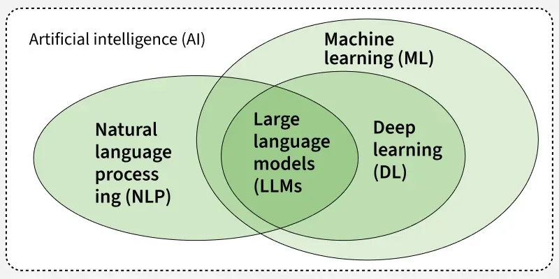

### Ai usecases 2025: 

1. Perception
What it does: Extract features from images/videos.
Industries: Healthcare (medical imaging), Automotive (autonomous driving), Security (surveillance).
Tech: CNNs, Vision Transformers (ViT), Image Segmentation (U-Net); Deep Learning (Computer Vision).

2. Speech Recognition
What it does: Convert spoken audio to text.
Industries: Customer Support, Consumer Electronics (voice assistants), Automotive (voice commands).
Tech: RNNs, LSTMs, Transformers, CTC loss; Deep Learning (Speech Processing/NLP).

3. Text Understanding
What it does: Comprehend text intent, entities, sentiment.
Industries: Finance (document analysis), Legal (contract review), Customer Service.
Tech: Transformers (BERT, RoBERTa), Named Entity Recognition (NER); Deep Learning (NLP).

4. Text Generation
What it does: Produce coherent language output.
Industries: Marketing (content creation), Media (summarization), Education (tutoring).
Tech: Autoregressive Transformers (GPT family), Seq2Seq models; Deep Learning (NLP).

5. Knowledge Retrieval
What it does: Retrieve relevant external info for tasks.
Industries: Tech Support, Research, Healthcare.
Tech: Dense vector retrieval with k-NN, embedding models (BERT embeddings), combined with LLMs (RAG); ML + DL (Information Retrieval + NLP).

6. Multimodal Fusion
What it does: Align and integrate multiple data types.
Industries: Retail (visual search), Entertainment (video captioning), Autonomous Systems.
Tech: Multimodal Transformers, Cross-Attention; Deep Learning (Multimodal AI).

7. Prediction
What it does: Forecast or detect anomalies from data.
Industries: Finance (fraud detection), Manufacturing (predictive maintenance), Energy (demand forecasting).
Tech: Regression, Random Forest, Gradient Boosting, LSTM; Machine Learning + Deep Learning (Time-Series Analysis).

8. Decision Making
What it does: Optimize actions/plans based on goals.
Industries: Logistics (route planning), Robotics, Gaming.
Tech: Reinforcement Learning (Q-learning, Policy Gradients), Heuristic Search; Machine Learning (Reinforcement Learning).

9. Generative Content Creation
What it does: Create new images, audio, code, etc.
Industries: Advertising, Software Dev, Arts & Music.
Tech: GANs, Diffusion Models, Autoregressive models (Codex); Deep Learning (Generative Models).

10. Autonomous Agents
What it does: Autonomous perception, reasoning, and action.
Industries: Autonomous Vehicles, Virtual Assistants, Industrial Automation.
Tech: Integration of CNNs, Transformers, RL, Planning Algorithms; AI Systems + ML + DL (Agent-based AI).


## Different section in AI: 

###  Artificial Intelligence (AI)
AI is the broad field of creating intelligent systems that can mimic human behavior.

#### 1. Symbolic AI / Classical AI
- Rule-Based Systems
- Knowledge Graphs
- Expert Systems

#### 2. Machine Learning (ML)
ML is a subset of AI focused on systems that learn from data.

#### 2.1 Learning Paradigms
- **Supervised Learning**
  - Tasks: Regression, Classification
  - Algorithms:
    - Linear Regression
    - Logistic Regression
    - Decision Trees
    - Random Forest
    - Support Vector Machine (SVM)

- **Unsupervised Learning**
  - Tasks: Clustering, Dimensionality Reduction
  - Algorithms:
    - K-Means
    - DBSCAN
    - PCA
    - t-SNE

- **Semi-Supervised Learning**

- **Self-Supervised Learning**

- **Reinforcement Learning (RL)**
  - Algorithms:
    - Q-Learning
    - SARSA
    - Deep Q-Network (DQN)
    - Proximal Policy Optimization (PPO)
    - A3C, DDPG, etc.

#### 2.2 ML Techniques
- **Classical ML** – Uses above algorithms
- **Deep Learning (DL)** – Uses neural networks:
  - Feedforward Neural Networks (FNN / DNN)
  - Convolutional Neural Networks (CNN)
  - Recurrent Neural Networks (RNN)
    - LSTM, GRU
  - Autoencoders (AE, VAE)
  - Generative Adversarial Networks (GANs)
  - Transformers
    - Used in NLP, LLMs, Vision, Speech

---

### Application Domains

#### 3.1 Natural Language Processing (NLP)
Processes and understands human language.

- **Tasks:**
  - Text Classification
  - Named Entity Recognition (NER)
  - Machine Translation
  - Summarization, QA

- **Models:**
  - RNN, LSTM
  - BERT, RoBERTa
  - GPT Series
  - T5, XLNet

- **Includes: Large Language Models (LLMs)**
  - GPT-3, GPT-4, GPT-4o
  - LLaMA, Claude, PaLM
  - Used in chatbots, agents, RAG systems

#### 3.2 Computer Vision (CV)
Processes and understands visual data (images, videos).

- **Tasks:**
  - Image Classification
  - Object Detection
  - Image Segmentation
  - Image Generation

- **Models:**
  - CNNs: VGG, ResNet, EfficientNet
  - Vision Transformers (ViT, DINO)
  - GANs: StyleGAN, CycleGAN

- **Applications:**
  - Facial Recognition, OCR, Medical Imaging

### 3.3 Speech / Audio Processing
Processes audio and speech.

- **Tasks:**
  - ASR (Automatic Speech Recognition)
  - TTS (Text-to-Speech)
  - Speaker Identification

- **Models:**
  - RNNs, CNNs
  - Transformers (e.g., Whisper)
  - WaveNet, Tacotron

#### 3.4 Multimodal AI
Combines multiple input types: text + image + audio + video.

- **Examples:**
  - CLIP (text + image)
  - Whisper (speech + text)
  - Flamingo, GPT-4o, Gemini, Sora

#### 3.5 Retrieval-Augmented Generation (RAG)
Combines LLMs with external data sources.

- **Components:**
  - Embedding Models
  - Vector Databases (e.g., FAISS, Pinecone)
  - LLMs for answer generation

- **Use Cases:**
  - Chat over documents
  - Internal knowledge bots
  - QA over web, PDFs, databases

## NLP vs LLM  (Brief)

- NLP is the science of understanding and working with language.
- LLMs are advanced tools (like ChatGPT) used within NLP to understand and generate text.
- Gen AI is the bigger umbrella that includes LLMs and also tools that make:
  - Images (like DALL·E, Midjourney)
  - Music (like Suno)
  - Videos (like Sora)
  - Code (like GitHub Copilot)


## NLP Learning: 

**Text Preprocessing**: Clean and prepare text for models.
- **Tokenization**: Split text into meaningful units
  - Word-level: "Hello world!" → ["Hello", "world", "!"]
  - Subword (BPE): "unhappiness" → ["un", "happy", "ness"] (handles rare words)
  - Character-level: "cat" → ["c", "a", "t"] (for noisy text)
  - Tools: `nltk.word_tokenize()`, `spacy.tokenizer`, `transformers.AutoTokenizer`

- **Normalization**: Standardize text format
  - Lowercase: "Apple iPhone" → "apple iphone"
  - Remove accents: "café" → "cafe"
  - Expand contractions: "don't" → "do not"
  - Handle URLs/emails: "Check https://..." → "Check [URL]"

- **Stopword removal**: Filter common words that add little meaning
  - English: ["the", "and", "or", "but", "in", "on", "at", "to", "for"]
  - Context matters: Keep "not" for sentiment analysis
  - Custom lists: Remove domain-specific words like "patient" in medical texts

- **Stemming vs Lemmatization**:
  - Stemming (crude): "running", "runs", "ran" → "run" (Porter Stemmer)
  - Lemmatization (smart): "better" → "good", "mice" → "mouse" (uses POS tags)
  - Example pipeline: "I'm loving McDonald's!!!" → tokenize → normalize → remove stopwords → lemmatize → ["love", "mcdonald"]

**Embeddings**: Convert text to vectors that capture semantic meaning.
- **Word Embeddings Evolution**:
  - One-hot: "cat" = [0,0,0,1,0...] (sparse, no meaning)
  - Word2Vec: "cat" = [0.2, -0.1, 0.8, 0.3...] (dense, context-aware)
  - GloVe: Global co-occurrence statistics
  - FastText: Handles out-of-vocabulary words with subword info

- **Sentence/Document Embeddings**:
  - Simple average: Average word vectors (loses word order)
  - Doc2Vec: Learns document-level representations
  - BERT/RoBERTa: Contextual embeddings (same word, different vectors in different contexts)
  - Sentence-BERT: Optimized for sentence similarity

- **Practical Examples**:
  - Word similarity: cosine("king", "queen") = 0.7, cosine("king", "apple") = 0.1
  - Sentence similarity: "I love pizza" vs "Pizza is amazing" → 0.85 similarity
  - Semantic search: "car repair" finds "automobile maintenance" (0.78 similarity)
  - Code: `model = SentenceTransformer('all-MiniLM-L6-v2'); embeddings = model.encode(["text1", "text2"])`

**Transformers & Attention**: Self-attention finds relationships between words.
- **Attention Mechanism Explained**:
  - Query: What am I looking for?
  - Key: What information do I have?
  - Value: What information do I return?
  - Formula: Attention = softmax(QK^T/√d)V

- **Multi-Head Attention**: Different attention heads focus on different relationships
  - Head 1: Subject-verb relationships ("cat" → "sits")
  - Head 2: Adjective-noun relationships ("big" → "house")
  - Head 3: Long-range dependencies ("it" → "the book from earlier")

- **Context Examples**:
  - "The bank by the river is steep" → "bank" attends to "river", "steep"
  - "I deposited money in the bank" → "bank" attends to "money", "deposited"
  - "Apple makes great phones" vs "I ate an apple" → same word, different attention patterns

- **BERT vs GPT**:
  - BERT: Bidirectional, sees full context, great for understanding
  - GPT: Unidirectional, predicts next word, great for generation
  - Usage: BERT for embeddings/classification, GPT for text generation

**Semantic Search**: Match by meaning, not keywords.
- **Traditional vs Semantic**:
  - Keyword search: "python programming" only matches exact terms
  - Semantic search: "python coding" matches "software development", "programming tutorials"
  - BM25 (keyword) + Dense vectors (semantic) = Hybrid search (best of both)

- **Real-world Examples**:
  - Medical: "chest pain" finds "cardiac discomfort", "thoracic pain"
  - Legal: "contract breach" finds "agreement violation", "covenant default"
  - E-commerce: "running shoes" finds "athletic footwear", "jogging sneakers"

- **Implementation Details**:
  - Cosine similarity: measures angle between vectors (-1 to 1)
  - Dot product: faster but affected by vector magnitude
  - Euclidean distance: measures vector distance (smaller = more similar)
  - Code: `similarities = cosine_similarity(query_vec.reshape(1, -1), doc_vecs)`

**Vector Databases**: Fast similarity search at scale.
- **Why Regular Databases Don't Work**:
  - PostgreSQL: Can store vectors but slow similarity search (full scan)
  - Vector DB: Specialized indexes (HNSW, IVF) for fast approximate search
  - Speed: 1M vectors, PostgreSQL ~30 seconds, FAISS ~5 milliseconds

- **Popular Options**:
  - **FAISS** (Facebook): Local, fastest, complex setup
    - `index = faiss.IndexFlatIP(384); index.add(embeddings); distances, indices = index.search(query, k=5)`
  - **Pinecone**: Cloud, managed, expensive but simple
    - `index.upsert(vectors); results = index.query(vector=query_vec, top_k=5)`
  - **Chroma**: Local, Python-friendly, good for prototyping
    - `collection.add(documents=docs, embeddings=embeddings, ids=ids)`
  - **Weaviate**: GraphQL interface, built-in ML models
  - **Qdrant**: Rust-based, fast, good filtering

- **Index Types**:
  - Flat: Exact search, slow but accurate
  - HNSW: Hierarchical graphs, fast approximate search
  - IVF: Inverted file index, good for large datasets

**Chunking Strategies**: Break documents without losing context.
- **Why Chunking Matters**:
  - LLM context limits: GPT-3.5 (4k tokens), GPT-4 (8k-128k tokens)
  - Embedding models: Usually 512 tokens max input
  - Retrieval precision: Smaller chunks = more precise matches

- **Chunking Methods**:
  - **Fixed-size**: 500 characters, simple but crude
  - **Sentence-aware**: Split at sentence boundaries, preserves meaning
  - **Paragraph-based**: Natural document structure
  - **Semantic chunking**: Split when topic changes (using embeddings)
  - **Recursive**: Try sentences → paragraphs → fixed-size as fallback

- **Overlap Strategy**:
  - No overlap: "...temperature rises. This causes..." → context lost
  - With overlap: "...temperature rises. This causes ice to melt. This causes..." → context preserved
  - Typical: 10-20% overlap (50-100 words for 500-word chunks)

- **Advanced Techniques**:
  - **Parent-child**: Store small chunks for retrieval, large chunks for context
  - **Sliding window**: Move window by half chunk size
  - **Metadata preservation**: Keep source, page number, section headers
  - Code example:
  ```python
  from langchain.text_splitter import RecursiveCharacterTextSplitter
  splitter = RecursiveCharacterTextSplitter(
      chunk_size=1000, chunk_overlap=200,
      separators=["\n\n", "\n", ". ", " ", ""]
  )
  chunks = splitter.split_text(document)
  ```

**Prompt Engineering**: Structure queries for better LLM responses.
- **Basic Principles**:
  - Be specific: "Summarize in 3 bullet points" vs "Summarize"
  - Provide context: Include relevant background information
  - Use examples: Few-shot prompting improves accuracy
  - Set constraints: "Use only the provided context"

- **RAG-Specific Prompting**:
  - **System prompt**: Set role and behavior
  - **Context injection**: Insert retrieved documents
  - **Question formatting**: Clear, specific questions
  - **Answer constraints**: "Based only on the context provided"

- **Template Examples**:
  ```
  System: You are a helpful assistant that answers questions based on provided context.
  
  Context: {retrieved_documents}
  
  Question: {user_question}
  
  Instructions:
  - Answer based only on the provided context
  - If the context doesn't contain the answer, say "I don't have enough information"
  - Cite specific parts of the context in your response
  - Be concise but complete
  
  Answer:
  ```

- **Advanced Techniques**:
  - **Chain-of-thought**: "Let's think step by step..."
  - **Self-consistency**: Generate multiple answers, pick most common
  - **Few-shot examples**: Show desired input/output format
  - **Role prompting**: "As a medical expert..." for domain-specific responses

**Missing pieces for complete RAG understanding:**

**Retrieval Scoring**: Understanding relevance metrics beyond cosine similarity - BM25 for keyword matching, hybrid search combining dense + sparse retrieval, re-ranking with cross-encoders.

**Context Window Management**: How to fit retrieved chunks in LLM's token limit (4k, 8k, 128k). Smart truncation, summarization of long contexts.

**Evaluation Metrics**: RAGAS (faithfulness, relevance), human eval, A/B testing. How do you know your RAG is working well?

**Advanced Techniques**: Query rewriting ("What's the capital?" → "What is the capital city of France?"), multi-step retrieval, metadata filtering, parent-child chunking.

The fundamentals above are 80% of what you need. The missing 20% comes from hands-on building and debugging real RAG systems. Start building now!


## RAG Deep dive:

### RAG Deep Dive 2025 (Complete Learning Path)


1. General Overview
    - Ingestion pipeline ( put documents in db).
      - chunks
      - embeddings
      - insert in db. 
    - Retrieval 
      - question 
      - chunk
      - embedding generation.
      - find near by embeddings, topk type.
    - Generation
      - send nearby embeddings to llm and questions.
      - generate response. 
 
2. Optimisation: ( Advance RAG )
    - Query translation
      - multiple query
      - query fusion
      - etc.
    - routing
    - query contruction
    - indexing

Ref for later and deep diving: 
- pdf attached.
- https://github.com/langchain-ai/rag-from-scratch?tab=readme-ov-file
- https://mallahyari.github.io/rag-ebook/04_advanced_rag.html
- https://www.coursera.org/learn/retrieval-augmented-generation-rag


## AI agents deep dive:

## MCP server:

## High level understanding of multi modal:

## LLM architecture deep dive:


